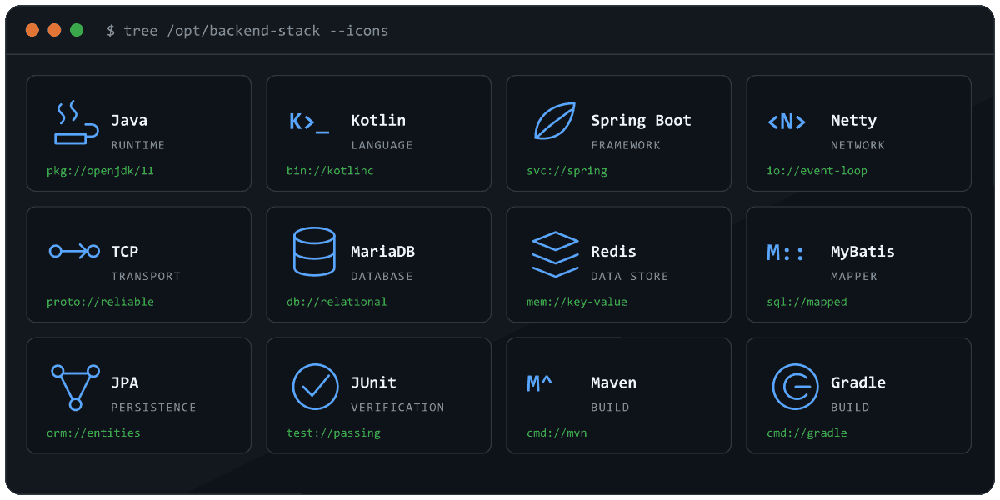
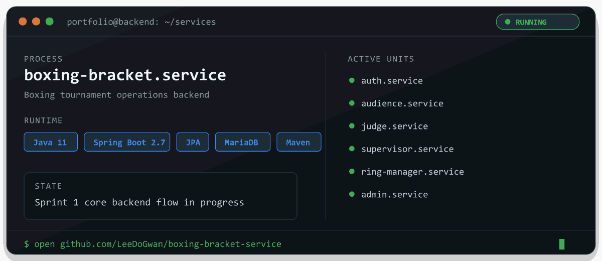

```console
LeeDoGwan@github:~$ ssh portfolio@backend
Last login: Thu Jul 10 2026 from github.com

portfolio@backend:~$ ./neofetch --profile
                 .--.                    OS: Backend GNU/Linux
                |o_o |                   Host: LeeDoGwan@github
                |:_/ |                   Role: Backend Engineer
               //   \ \                  Kernel: Java 11 / Spring Boot 2.7
              (|     | )                 Shell: root-cause-first
             /'\_   _/`\                 Focus: performance, reliability, networking
             \___)=(___/                 Status: building maintainable systems
```

## `$ tree /opt/backend-stack`



```text
/opt/backend-stack
├── runtime/        Java · Kotlin · Spring Boot · Netty
├── transport/      TCP
├── persistence/    MariaDB · Redis · MyBatis · JPA
├── verification/   JUnit
└── build/          Maven · Gradle
```

## `$ ./portfolio start`

```console
portfolio@backend:~$ ./portfolio start --foreground
[  OK  ] mounted project registry
[  OK  ] loaded backend modules
[  OK  ] connected repository origin
[ READY ] portfolio process is accepting connections
```

[](https://github.com/LeeDoGwan/boxing-bracket-service)

## `cat /etc/profile.d/engineering-principles.sh`

```bash
export RELIABILITY="before cleverness"
export DECISIONS="measurements before assumptions"
export CHANGES="small and testable"
export ARCHITECTURE="clear boundaries, maintainable structure"
```

```console
portfolio@backend:~$ uptime
up, learning, building, and improving

portfolio@backend:~$ █
```
